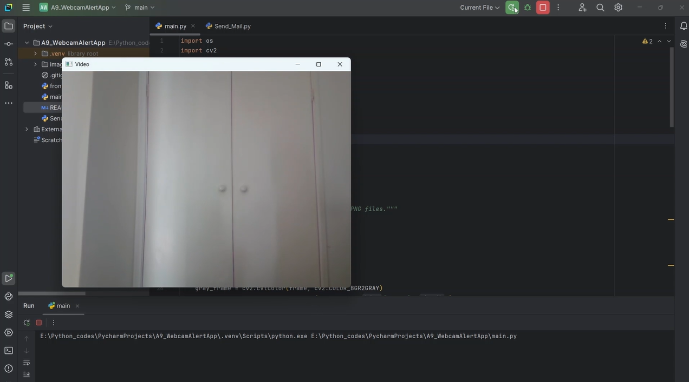
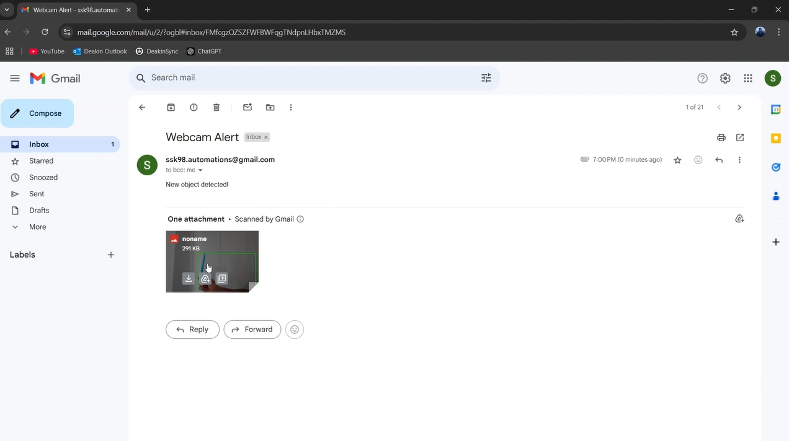

# 📷 Webcam Alert App

A Python application that detects motion using your webcam and sends an email alert with a snapshot of the detected motion. This project uses **OpenCV** for motion detection and **SMTP** for sending email alerts.

(Right now only IDE compactible - Has pottential to integrate with the streamlit frontend)

---

## 🛠️ Features

- **Motion Detection**: Detects motion in real-time using your webcam.
- **Email Alerts**: Sends an email with a snapshot of the detected motion.
- **Timestamped Frames**: Adds timestamps to the captured frames for reference.
- **Threaded Operations**: Uses threading for efficient email sending and folder cleanup.

---

## 🚦 How to Use

1. Install the required dependencies (`opencv-python`, `streamlit`, and `smtplib`).
2. Set up environment variables for your email credentials (`WebcamMotionDetector`).
3. Run the script to start the webcam and enable motion detection.
4. When motion is detected, an email alert with a snapshot will be sent.

---

## 📸 Screenshots

---

## 🎥 Demo

---

## 📬 Contact

Feel free to explore the project and share your feedback. For any inquiries, suggestions, or contributions, reach out to me at **sathiyanarayanan.s1698@gmail.com**.
